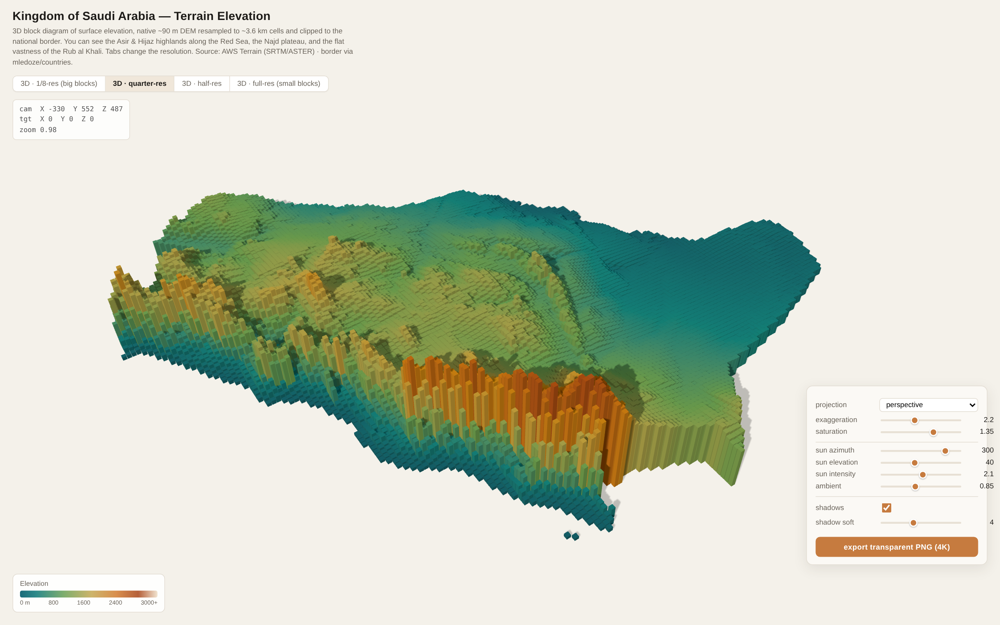

# Middle East — 3D Terrain Block Diagram

A three.js-powered, interactive 3D block diagram of **surface elevation across the
Middle East** — 17 countries including **Turkey** and **Iran** — clipped to national
borders. Inspired by Evan Applegate's US forest-canopy block diagram, but since the
region is largely arid with negligible tree canopy, the meaningful analogue here is
**terrain elevation**.

Each column is a cell of a digital elevation model. You can pick a single country to
focus on, or view the whole region: Turkey's **Anatolian plateau** and Taurus, Iran's
**Zagros** and the **Alborz** (Mt Damavand), the Caucasus edge, the **Arabian
escarpment** along the Red Sea, and the flat **Rub al Khali**.



## Features

- **Country focus** — a dropdown to isolate any of the 17 countries (Iran, Türkiye,
  Saudi Arabia, Egypt, …) or show the whole region; the camera auto-frames the choice.
- **Resolution tabs** — 1/8, quarter, half, and full resolution (up to ~324k columns).
- **Orthographic / perspective** projection toggle.
- **Sliders** — vertical exaggeration, colour saturation, sun azimuth / elevation /
  intensity, ambient light, and shadow softness.
- **Real-time drop shadows** and a hypsometric colour ramp (teal lowlands → sand →
  orange highlands → pale peaks), auto-scaled to the region's max elevation.
- **Export transparent 4K PNG** of the current view.
- Live camera HUD (position / target / zoom).

## Run

No build step or server framework needed — it's static files plus vendored three.js.

```bash
npm install        # only needed to (re)build the data; three is vendored in src/vendor
npm run serve      # serves the app at http://localhost:8099
```

Then open <http://localhost:8099/>. (A server is required because the app fetches the
data files as ES-module resources.)

### Single-file build (no server)

`dist/middle-east-terrain.html` is a fully self-contained build — three.js, the
elevation data, and all code inlined, with **no external requests**. Just open it in a
browser, or host it anywhere as a single file. Regenerate it with:

```bash
npm run build-artifact
```

## Data

The elevation grid is pre-baked into `data/region_elevation.bin.gz` (gzipped: Int16
elevations + a Uint8 country-id per cell, row-major) with metadata — including each
country's cell bounding box for camera framing — in `data/region_elevation.json`.

To regenerate it from source:

```bash
npm install
npm run build-data
```

`scripts/build_data.mjs` downloads public **AWS Terrain ("terrarium") DEM tiles**
(NASA SRTM/ASTER, no API key), decodes the elevation-encoded PNGs, resamples them
onto a ~4.7 km grid, and rasterises each country's border polygon (from
[mledoze/countries](https://github.com/mledoze/countries), ODbL) into a per-cell
country id. Edit the `COUNTRIES` array at the top of the script to change the region.

## Layout

```
index.html                    UI shell, styles, controls
src/app.js                    three.js scene, instanced blocks, focus + framing
src/vendor/                   vendored three.js + OrbitControls (no CDN needed)
data/                         baked, gzipped elevation + country-id grid
scripts/build_data.mjs        reproducible data pipeline
scripts/serve.mjs             tiny static dev server
```

## Credits

- Elevation: AWS Terrain Tiles (SRTM / ASTER), via the terrarium encoding.
- Borders: mledoze/countries (ODbL).
- Concept inspired by Evan Applegate's GEDI canopy-height block diagram of the US.
